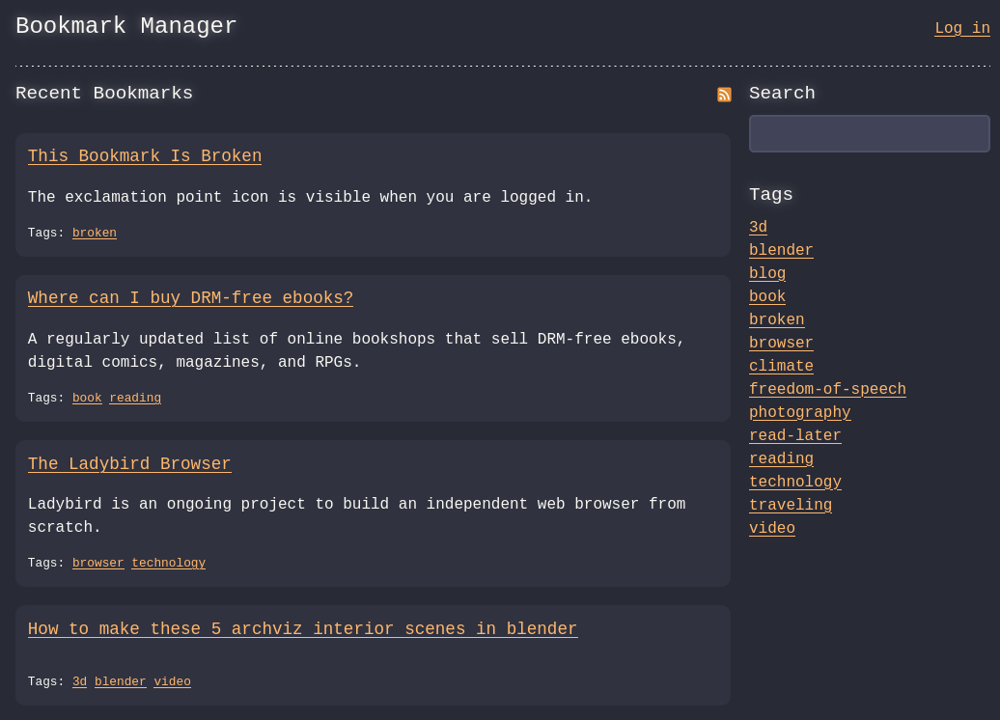
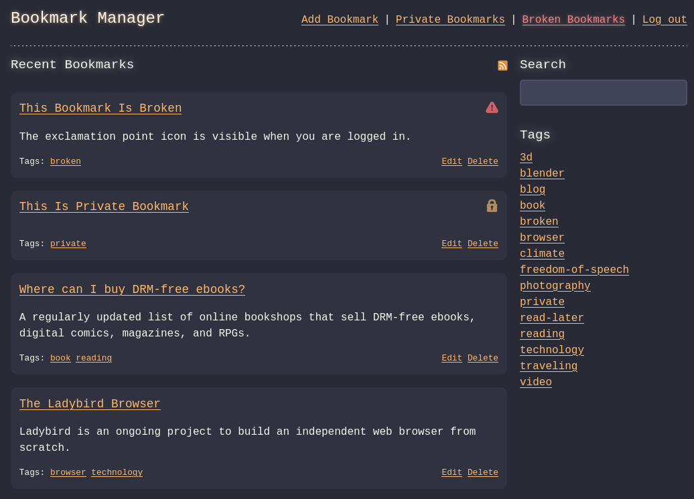

# Bookmark Manager
A minimalistic self-hosted bookmark manager written in [Go](https://go.dev/).

The app aims for simplicity. That is why it is not filled with features. Bookmarks are
stored in SQLite database, so heavy database engines are not needed and makes database
backups easy to do.

Bookmarks can be marked as private. Private bookmarks are visible only for authenticated
users. Each bookmark can also have tags. RSS feed is available for recent bookmarks and
for each tag. The app can also do [scheduled bookmark checks](#scheduled-bookmark-check).

Bookmark Manager aims to be as accessible as possible. It should have a pretty a quite good
screen reader support, but if have an idea how to make it even better, feel free to file an issue!

**The app is still under heavy development. Breaking changes are quite likely.**

## How to run
1. Copy the following example files:
   - bookmarks.db.example ➔ bookmarks.db
   - docker-compose.yml.example ➔ docker-compose.yml
   - config.yml.example ➔ config.yml
2. Configure settings in `config.yml`. Each setting is described in the config file.

### Running with Docker (recommended)
```
docker-compose up [-d]
```
By default, the forwarded port is 8000. You can change this in the `docker-compose.yaml`.

### Running with Go
```
go run .
```
Be default, the app is listening to port 8000. You can change this in the `config.yml`.

## Scheduled bookmark check
The app can check for broken bookmarks, but this feature is disabled by default.
To enable the check, set the `check_interval` setting in `config.yml` to `1` or more.
If you want the check to run when the app starts, set the `check_on_app_start` setting to `true`.

Broken bookmarks are indicated by an exclamation point icon. Yuo will also see a *Broken Bookmarks* link in the top navigation bar, which will take you to a view listing all broken bookmarks. These are only visible if you are logged in.

Bookmark Manager can send a notification when it detects broken bookmarks. Currently, only
[Gotify](https://gotify.net/) notifications are supported. To enable notifications, set
the `gotify_enabled` setting to `true` and set `gotify_url` and `gotify_token` settings to match your
environment.

## Screenshots
UI for guests



UI for authenticated users



## Plans for the future
- Themes